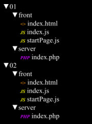
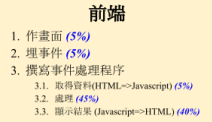
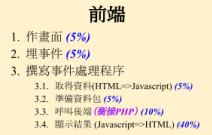
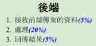
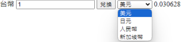
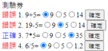
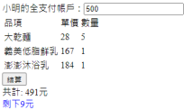
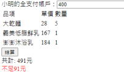
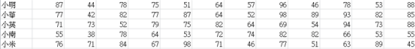
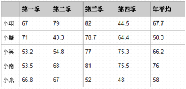

# 計分標準
1. 每題均分成前端 (front) 與後端 (server) 兩個資料夾，前端至少包含3個檔案：index.html, index.js, startPage.js，後端至至少包含1個檔案：index.php，假設考試題目共 有二題，答案請依據下列格式，否則不予計分。



2. 每題的計分標準，分成純前端與前後端兩種






# Q1
輸入台幣金額，選擇不同幣別，計算兌換金額。（兌換率計算在後端完成）（20%） （前後端）




## 匯率
```
台幣→美元 0.030628

台幣→日元 4.675082

台幣→人民幣 0.220994

台幣→新加坡幣 0.041442
```

# Q2 
試設計一個測驗券（至少4題，每題數字可以自行設定），但必需由Radio Button來實作，並將結果送到後端，判定答案是否正確，如果正確就由藍色顯示，錯誤由紅色顯示，如下圖（25%）（前後端）



# Q3
小明在全聯的全支付帳戶共有x元（自行輸入），今購買了下列商品（自行輸入），試計 算剩下多少元（藍色顯示）或不足多少元（紅色顯示），顯示畫面如下。（30%）（純前端）




# Q4
輸入公司5個人今年的每個月業績，請計算每個人的季平均、年平均（請以表格顯示）。若低於年平均的請以紅字表示。（40%）（純前端）



