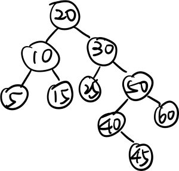

# chapter 6

## 6.1 練習題

### 有一顆樹其分支度為8，並且有25個節點，試問此棵樹需要多少個 LINK 欄位，實際上用了幾個，並浪費了多少個 LINK。

* 需要 $25 \times 8 = 200$ 個 LINK 欄位。
* 實際上用了 24 個 LINK 欄位。
* 浪費了 $200 - 24 = 176$ 個 LINK 欄位。

## 6.2 練習題

### 1. 有一課樹如右，試回答下列問題


(a) 它是一棵二元樹嗎？

* yes

(b) 它是一棵滿二元樹嗎？

* no

(c) 它是一棵完全二元樹嗎？

* no

### 2 假設樹根的階度為 $1$，而且整棵二元樹的階度為 $8$，試問回答下列問題。

(a) 此棵二元樹總共有多少個節點？

* $2^8 - 1 = 255$

(b) 第 $6$ 階度最多有幾個節點？

* $2^5 = 32$

(c) 假使樹葉節點共有$128$個，則分支度為$2$的節點共有幾個？

* $255 - 128 = 127$

## 6.3 練習題

### 若以一維陣列儲存一棵三元樹，則每一階度所儲存的節點應如何表示之。

* 第 $n$ 階度所儲存的節點為 $3^{n-1}$ 到 $3^n - 1$。

## 6.4 練習題

### 有一棵二元樹如下：


試分別利用前序追蹤，中序追蹤及後序追蹤，寫出其拜訪順序。

* 前序追蹤：a b d h e c f i g
* 中序追蹤：d h b e a f i c g
* 後序追蹤：h d e b a i f g c

## 6.5 練習題

有一課引線二元樹如下：


1. 試說明如何刪除 $50$ 節點。

    * 將 $80$ 的左子樹指向 $10$，將 $10$ 的右指樹指向 $60$，將 $55$ 的右指樹指向 $10$ 

2. 解說刪除的節點有一分支度的情形，請以圖形輔助之。

## 6.6 練習題

### 1. 將圖 6.1 的一般樹轉換成二元樹。


### 2. 已知有一棵二元樹，中序追蹤為 ECBDA，前序追蹤為 ABCED，試畫出此棵二元樹。


### 3. 已知有一棵二元樹，中序追蹤為 DFBAEGC，後序追蹤為 FDBGECA，試畫出此棵二元樹。


## 6.9 動動腦

### 6. 將下列幾棵二元樹, 利用 inorder, preorder, postorder 追蹤, 並寫出其拜訪順序。


(a)
* inorder: F E B G H I J D C A
* preorder: A B E F C G D H I J
* postorder: F E G J I H D C B A

(b)
* inorder: B C D A F E I H G
* preorder: A B C D E F G H I
* postorder: D C B F I H G E A

(c)
* inorder: F D H G I B E A C 
* preorder: A B D F G H I E C
* postorder: F H I G D E B C A

### 9. 請回答下列問題

#### (a) 略述二元樹在計算機上表示方法，並估計所需要的空間節點數目之關係。

* 二元樹在計算機上表示方法有：
    * 指標表示法
    * 陣列表示法
* 估計所需要的空間節點數目之關係：
    * 指標表示法：若有 $i$ 個階度，$n = 2^i - 1$ 個節點，需要 $2^i - 1$ 個指標，需要 $ n \times sizeOfData + 2^i - 1 \times sizeOfPointer$ 個空間。
    * 陣列表示法：若有 $i$ 個階度，$n = 2^i - 1$ 個節點，需要 $n\times sizeOfData$ 個空間。


#### (b) 依上題之表示法，如何做 inorder 追蹤。

* 指標表示法：
    * 遞迴：
        * 先拜訪左子樹
        * 再拜訪節點
        * 再拜訪右子樹
    * 非遞迴：
        * 使用堆疊
            * 將節點壓入堆疊
            * 重複拜訪左子樹，直到左子樹為空
            * 拜訪節點
            * 將節點的右子樹壓入堆疊
            * 重複上述步驟，直到堆疊為空
* 陣列表示法：
    * 遞迴：
        * 先拜訪左子樹
        * 再拜訪節點
        * 再拜訪右子樹
    * 非遞迴：
        * 使用堆疊
            * 將節點壓入堆疊
            * 重複拜訪左子樹，直到左子樹為空
            * 拜訪節點
            * 將節點的右子樹壓入堆疊
            * 重複上述步驟，直到堆疊為空


#### (c) 利用下述的二元樹為例，解釋(a)、(b)之做法。

```
      A
    /   \
   B     C
        / \
       D   E
        \
         F
```

指標表示法：
```c
struct Node {
    char data;
    struct Node* left;
    struct Node* right;
};


struct Node* root = createNode('A');
root->left = createNode('B');
root->right = createNode('C');
root->right->left = createNode('D');
root->right->right = createNode('E');
root->right->left->right = createNode('F');
```

中序追蹤：
```c
void inorder(struct Node* node) {
    if (node != NULL) {
        inorder(node->left);
        printf("%c ", node->data);
        inorder(node->right);
    }
}
```

陣列表示法：
```c
#define MAX_SIZE 100

char tree[MAX_SIZE];
int size = 0;

// 初始化樹
void initTree() {
    tree[0] = 'A';
    tree[1] = 'B';
    tree[2] = 'C';
    tree[3] = '\0';
    tree[4] = '\0';
    tree[5] = 'D';
    tree[6] = 'E';
    tree[7] = '\0';
    tree[8] = '\0';
    tree[9] = '\0';
    tree[10] = '\0';
    tree[11] = 'F';
    size = 12;
}

// 中序追蹤
void inorderArray(int index) {
    if (index < size && tree[index] != '\0') {
        inorderArray(2 * index + 1);  // 左子樹
        printf("%c ", tree[index]);   // 當前節點
        inorderArray(2 * index + 2);  // 右子樹
    }
}
```

## (d) 將上述的二元樹，試繪出其對應的引線二元樹。


## (e) 加上引線後，有何用途。

* 超快速遍歷所有節點

### 13. 將下列的一般樹或樹林轉換成二元樹。


### 14. 假設利用前序法追蹤，其順序為 ABCDEFGH，利用中序法追蹤，其順序為 CDBAFEHG，試繪出此棵二元樹。


# chapter 7

## 7.2 練習題

### 有一陣列共 $10$ 個資料如下，試依序輸入並建立一棵二元搜尋樹。

```
20 30 10 50 60 40 45 5 15 25
```



## 7.3 練習題

### 承 7.2 節練習題所建立的二元樹，依序加入 3 和 13 之後，再刪除 50 的二元搜尋樹。


## 7.7 動動腦

### 4.請將以下依序加入並建立一棵二元搜尋樹。

```
60 50 80 40 55 70 90 45 58
```


### 5.有一棵二元搜尋樹如下，請依序刪除 50, 80, 60，並畫出其所對應的二元搜尋樹。


# chapter 8

## 8.1 練習題

### 1. 將此二元樹調整為一棵 heap。


### 2. 將下列資料建立成一棵 Heap。

```
20 30 10 50 60 40 45 5 
```


### 3. 承 2，在已建立完成的 Heap 中，試刪除其 30, 60 兩個鍵值


## 8.2 練習題

### 1. 將下列資料建立成一棵 Min-Heap。

```
20 30 10 50 60 40 45 5 
```


## 8.3 練習題

### 有一 Min-Max heap 如下：


(a). 請依序加入 17, 8 , 2 並畫出其所對應的 Min-Max heap。


(b). 承 (a) 的結果，依序刪除 20 和 10 。


## 8.4 練習題

### 有一 Deap 如下：


(a). 請依序加入 2 和 50。


(b). 承 (a) 的結果，刪除 50。


## 8.6 動動腦

### 2. 有一棵 Heap 如下：


試回答下列問題

(a). 請依序加入 60 和 20 之後的 Heap 為何？


(b). 承 (a) 所建立的 Heap 依序刪除 60 和 23。


### 3. 試將下列資料建立一棵 Min-heap。

```
20 30 10 50 60 40 45 5 15 25
```

    

### 4. 將下列的二元樹調整為 Min-Max heap。


#### a. 


#### b.


