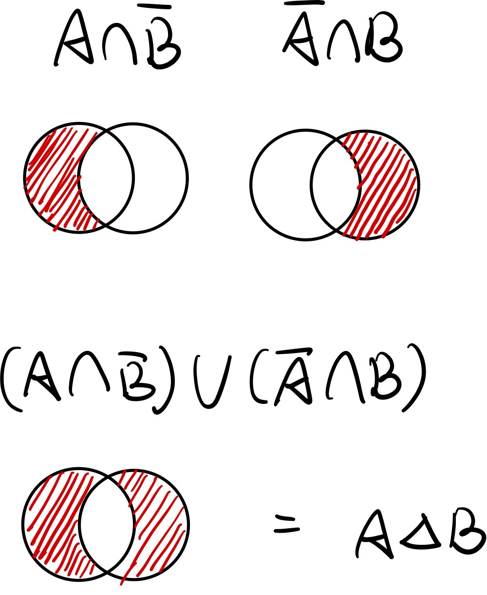

# chapter-2 homework

## 1. $A=\{\}$ (空集合)，求 $P(A)$。

$P(A) = \varnothing$

## 2. $A=\{a,b,c\}$，求 $P(A)$。

$P(A) = \{\varnothing, \{a\}, \{b\}, \{c\}, \{a,b\}, \{a,c\}, \{b,c\}, \{a,b,c\}\}$

## 3. $A=\{a,b,c,d,e,f\}$，求 $P(A)$。

$P(A) = \{\\
\varnothing, \{a\}, \{b\}, \{c\}, \{d\}, \{e\},\{f\},\\ 
\{a,b\}, \{a,c\}, \{a,d\}, \{a,e\}, \{a,f\}, \\
\{b,c\}, \{b,d\}, \{b,e\}, \{b,f\}, \\
\{c,d\}, \{c,e\}, \{c,f\}, \\
\{d,e\}, \{d,f\}, \\
\{e,f\}, \\
\{a,b,c\}, \{a,b,d\}, \{a,b,e\}, \{a,b,f\}, \{a,c,d\}, \{a,c,e\}, \{a,c,f\}, \{a,d,e\}, \{a,d,f\}, \{a,e,f\}, \\
\{b,c,d\}, \{b,c,e\}, \{b,c,f\}, \{b,d,e\}, \{b,d,f\}, \{b,e,f\}, \\
\{c,d,e\}, \{c,d,f\}, \{c,e,f\}, \\
\{d,e,f\}, \\
\{a,b,c,d\}, \{a,b,c,e\}, \{a,b,c,f\}, 
\{a,b,d,e\}, \{a,b,d,f\}, \{a,b,e,f\}, \{a,c,d,e\}, \{a,c,d,f\}, \{a,c,e,f\},\{a,d,e,f\}, \\
\{b,c,d,e\}, \{b,c,d,f\}, \{b,c,e,f\}, \{b,d,e,f\}, \\
\{c,d,e,f\}, \\
\{a,b,c,d,e\}, \{a,b,c,d,f\}, \{a,b,c,e,f\}, \{a,b,d,e,f\}, \{a,c,d,e,f\}, \\
\{b,c,d,e,f\}, \\
\{a,b,c,d,e,f\}\}$

## 4. 令 $B=\{1, \{1\}, \{1,2\}, 2\}$，以下何者為真，何者為假？

提示：$B$有四個元素：分別為$1$, $\{1\}$, $\{1,2\}$, $2$。

(1). $\{1\}\in B$：真
(2). $\{1\}\subseteq B$：真
(3). $\{1, 2\}\in B$：真
(4). $\{1, 2\}\subseteq B$：真
(5). $\{2\} \in B$：假
(6). $2 \in B$：真
(7). $\{2\} \subset B$：假
(8). $1 \in B$：真
(9). $\{2, \{1, 2\}\} \subseteq B$：假
(10). $\{\{1\},\{2\}, \{1, 2\}\} \not\subset B$：真

## 5. 求第四題的 $P(B)$。

$P(B) = \{\varnothing, \{1\}, \{2\}, \{1, 2\}, \{1, \{1, 2\}\}, \{2, \{1, 2\}\}, \{1, 2, \{1, 2\}\}\}$

## 6. 令 $U=\{1,2,3,4,5,6,7,8,9,10,11,12,13,14,15,16,17,18,19,20\}$，$A=\{1,5,15,20\}$，$B=\{3,6,9,12,15,18\}$，$C=\{2,4,6,8,10,12,14,16,18,20\}$, $D=\{2,3,5,7,11,13,17\}$

整理

$U=\{1,2,3,4,5,6,7,8,9,10,11,12,13,14,15,16,17,18,19,20\}$

$A=\{1,5,15,20\}$

$B=\{3,6,9,12,15,18\}$

$C=\{2,4,6,8,10,12,14,16,18,20\}$

$D=\{2,3,5,7,11,13,17\}$

---

### (1). $\overline{B}$ 及 $\overline{C}$

$\overline{B} = \{1,2,4,5,7,8,10,11,13,14,16,17,19,20\}$

$\overline{C} = \{1,3,5,7,9,11,13,15,17,19\}$

### (2). $(A\triangle B) \cup D$

$A\triangle B = \{1,3,5,6,9,12,18,20\}$

$(A\triangle B) \cup D = \{1,2,3,5,6,7,9,11,12,13,17,18,20\}$

### (3). $\overline{(B\cup C) - A}$

$B\cup C = \{2,3,4,6,8,9,10,12,14,15,16,18,20\}$

$(B\cup C) - A = \{2,3,4,6,8,9,10,12,14,16,18\}$

$\overline{(B\cup C) - A} = \{1,5,7,11,13,15,17,19, 20\}$

### (4). $\overline{B} \cap D$

$\overline{B} = \{1,2,4,5,7,8,10,11,13,14,16,17,19,20\}$

$D = \{2,3,5,7,11,13,17\}$

$\overline{B} \cap D = \{2,5,7,11,13,17\}$

### (5). $C-((A\cap B) \cup D)$

$A\cap B = \{15\}$

$(A\cap B) \cup D = \{2,3,5,7,11,13,15,17\}$

$C-((A\cap B) \cup D) = \{4,6,8,10,12,14,16,18\}$

## 7. 畫出以下各小題之范氏圖

### (1). $(A-B)\cap C$

### (2). $B \cap (A \triangle B)$

### (3). $(A-(B\cup C)) \cup (B-(A\cup C)) \cup (C-(A\cup B))$

### (4). 用口語說明第 3 小題所代表的集合為何？

$A\ B \ C$ 彼此沒有交集的部份的聯集。

## 8. 令 $U=\{x|x \in Z\}$且$x^2\leq 1024$, $A=\{-11,-18,25,28,11\}$, $B=\{3,9,16,22,25,28\}$, $C=\{-18,20,22,-24,26,28,-30,-17\}$ 及 $D=\{17,21,-6,27\}$。

整理：

$U=\{x|x \in Z\}$且$x^2\leq 1024$

$A=\{-11,-18,11,25,28\}$

$B=\{3,9,16,22,25,28\}$

$C=\{-30,-24,-18,-17,20,22,26,28\}$

$D=\{-6,17,21,27\}$

---

### (1). 若$E=\{-8,-1,5,7,9,11\}$。$A\ B\ C\ D$ 哪些集合與 $E$ 互斥？

$A \ C \ D$ 與 $E$ 互斥。

### (2). 任寫出兩個與 $C$ 互斥的集合。

1. $\{1,2,3\}$
2. $\{4,5,6\}$
 
## 9. 分別用代數推導法、范氏圖及元屬隸屬表證明
$$A\triangle B = (A\cap  \overline{B}) \cup (\overline{A} \cap B)$$

### (1). 代數推導法

$A\triangle B = (A-B) \cup (B-A)$

$= (A\cap \overline{B}) \cup (\overline{A} \cap B)$

$= (A\cap \overline{B}) \cup (\overline{A} \cap B)$

### (2). 范氏圖

### (3). 元屬隸屬表

|$A$ | $B$ | $A\triangle B$ | $A-B$ | $B-A$ | $(A\cap \overline{B}) \cup (\overline{A} \cap B)$
---|---|---|---|---|---
0 | 0 | 0 | 0 | 0 | 0
0 | 1 | 1 | 0 | 1 | 1
1 | 0 | 1 | 1 | 0 | 1
1 | 1 | 0 | 0 | 0 | 0

## 10. 用元素隸屬表證明

$$\overline{\overline{(A \cup B) \cap C} \cup \overline{B}} = B \cap C$$

$A$ | $B$ | $C$ | $A \cup B$ | $(A \cup B) \cap C$ | $\overline{(A \cup B) \cap C}$ | $\overline{B}$ | $\overline{\overline{(A \cup B) \cap C} \cup \overline{B}}$ | $B \cap C$
---|---|---|---|---|---|---|---|---
0 | 0 | 0 | 0 | 0 | 1 | 1 | 0 | 0
0 | 0 | 1 | 0 | 0 | 1 | 1 | 0 | 0
0 | 1 | 0 | 1 | 0 | 1 | 0 | 0 | 0
0 | 1 | 1 | 1 | 1 | 0 | 0 | 1 | 1
1 | 0 | 0 | 1 | 0 | 1 | 1 | 0 | 0
1 | 0 | 1 | 1 | 1 | 0 | 1 | 0 | 0
1 | 1 | 0 | 1 | 0 | 1 | 0 | 0 | 0
1 | 1 | 1 | 1 | 1 | 0 | 0 | 1 | 1

## 11. 設 $A-B=\{1,5,7,8,16,20\}$,$B-A=\{2,12,18\}$且$A\cap B=\{3,4,6,9,10\}$。則 $|{A}|=$? $|B|$=? $|A\cap B|$=? $|A \cup B|$=?

$|A| = 11$

$|B| = 8$

$|A\cap B| = 5$

$|A \cup B| = 14$

## 12. 設$A$與$B$互斥。在什麼條件下$|A\cup B| = |A|$?

$B = \varnothing$

## 13. 設 $|A|=22,|B|=30,|C|=28,|A\cap B|=10,|A \cap C|=8,|B \cap C|=9$且 $|A\cup B\cup C|=58$。則 $|A \cap B \cap C|=?\ |A-(B\cap C)|=?\ |B-(A \cup C)|=?$

$|A \cap B \cap C| = 22$

$|A-(B\cap C)| = 17$

$|B-(A \cup C)| = 16$

## 14. 第一大學決定推廣第二外語的學習，為瞭解大學部學生的意願，隨機抽訪180位學生，針對日語、法語及德語三種語言進行選修意願調查，得到以下的數據。其中 分別表示有意願選修這三種語言的人數：