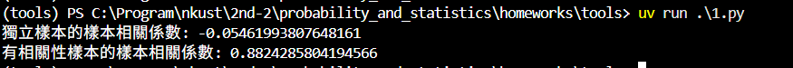
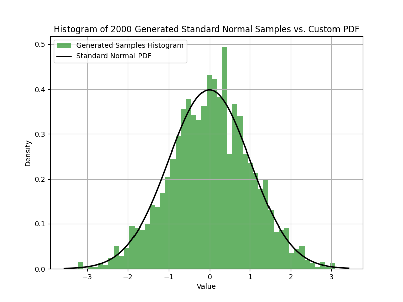
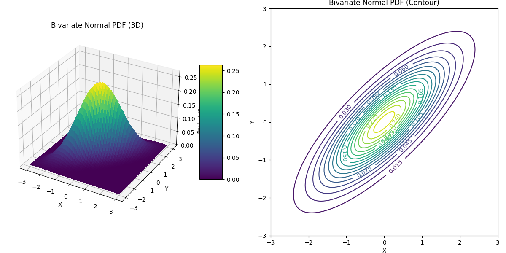
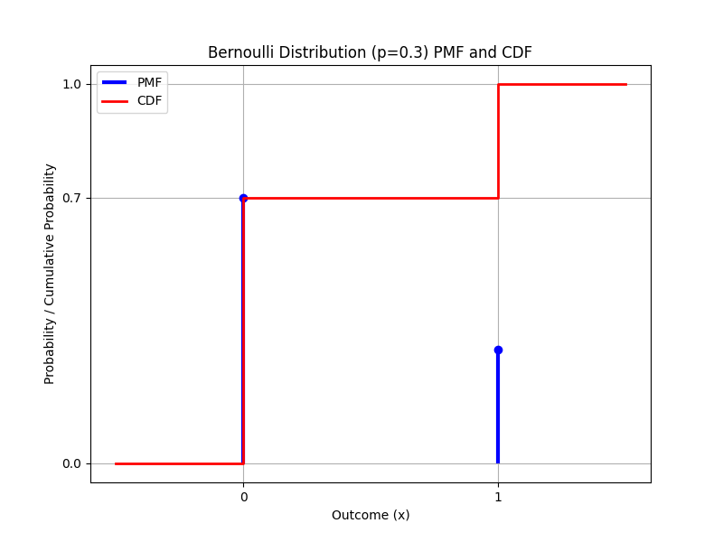
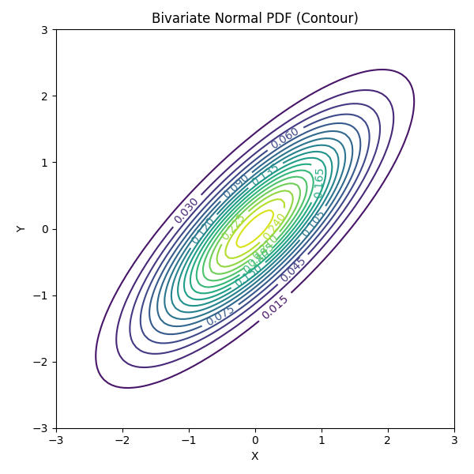
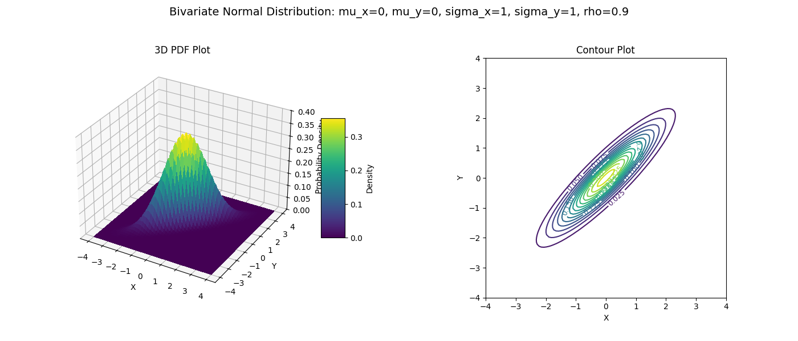
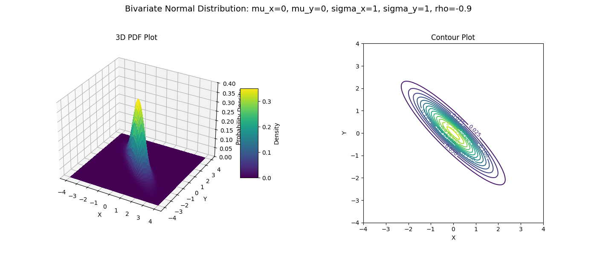
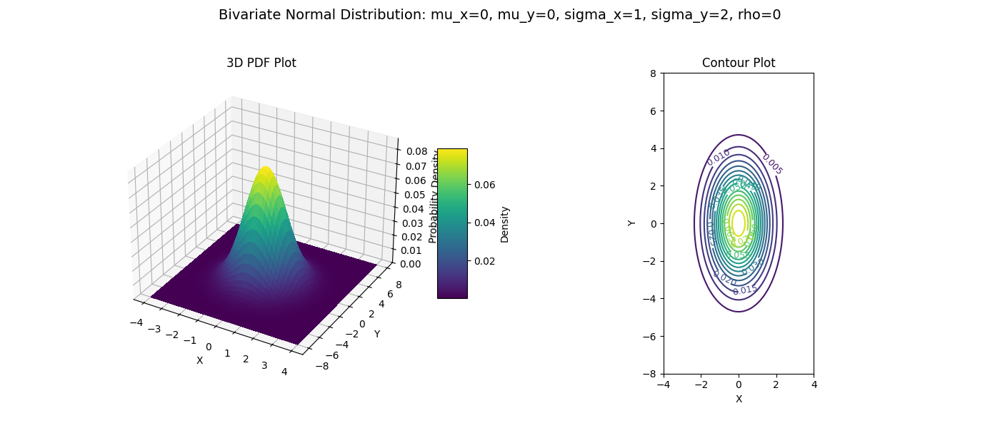
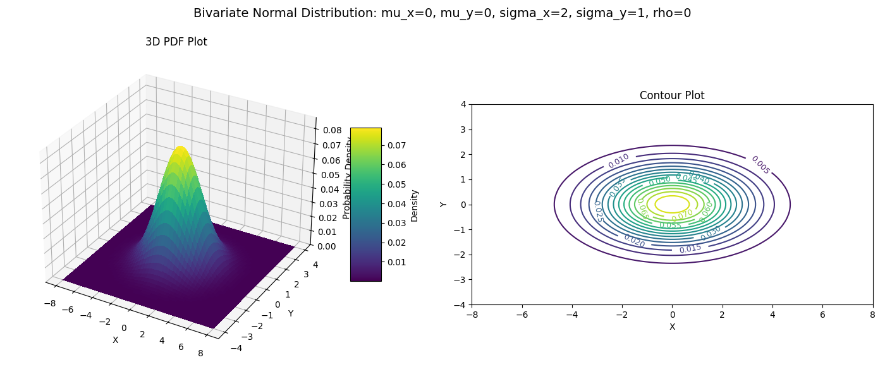
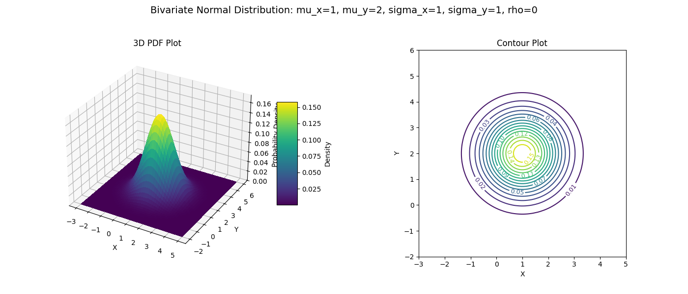

## 10-2-1

```python
import numpy as np

n_samples = 100

x_samples_independent = np.random.randn(n_samples)
y_samples_independent = np.random.randn(n_samples)

# 設定樣本數量
n_samples = 100

# 生成 X 的隨機樣本 
x_samples_correlated = np.random.randn(n_samples)

# 生成 Y 的隨機樣本，使其與 X 有線性關係並加入雜訊
# 假設 Y = X + 雜訊
noise = np.random.randn(n_samples) * 0.5 # 雜訊的標準差可以調整以控制相關性強度
y_samples_correlated =  x_samples_correlated + noise

# 計算獨立樣本的相關係數矩陣
correlation_matrix_independent = np.corrcoef(x_samples_independent, y_samples_independent)
sample_correlation_independent = correlation_matrix_independent[0, 1] # 取非對角線的值

print(f"獨立樣本的樣本相關係數: {sample_correlation_independent}")

# 計算有相關性樣本的相關係數矩陣
correlation_matrix_correlated = np.corrcoef(x_samples_correlated, y_samples_correlated)
sample_correlation_correlated = correlation_matrix_correlated[0, 1] # 取非對角線的值

print(f"有相關性樣本的樣本相關係數: {sample_correlation_correlated}")
```



## 10-2-2

```python
import numpy as np
import matplotlib.pyplot as plt

n_samples = 2000 # 要生成的常態分佈樣本數量

# --- 使用 Box-Muller 變換生成標準常態分佈樣本 ---
n_uniform_pairs = n_samples // 2

u1 = np.random.rand(n_uniform_pairs)
u2 = np.random.rand(n_uniform_pairs)

z1 = np.sqrt(-2 * np.log(u1)) * np.cos(2 * np.pi * u2)
z2 = np.sqrt(-2 * np.log(u1)) * np.sin(2 * np.pi * u2)

generated_samples = np.concatenate((z1, z2))
generated_samples = generated_samples[:n_samples]

def standard_normal_pdf(x):
  """
  計算標準常態分佈 (mu=0, sigma=1) 在 x 點的機率密度
  """
  mu = 0
  sigma = 1
  return (1 / (sigma * np.sqrt(2 * np.pi))) * np.exp(-((x - mu)**2) / (2 * sigma**2))


# 創建直方圖
plt.figure(figsize=(8, 6))
plt.hist(generated_samples, bins=50, density=True, alpha=0.6, color='g', label='Generated Samples Histogram')

# 生成一系列用於繪製 PDF 的 x 值
xmin, xmax = plt.xlim()
x = np.linspace(xmin, xmax, 100)
p = standard_normal_pdf(x)
plt.plot(x, p, 'k', linewidth=2, label='Standard Normal PDF')

# 添加圖例和標題
plt.title(f'Histogram of {n_samples} Generated Standard Normal Samples vs. Custom PDF')
plt.xlabel('Value')
plt.ylabel('Density')
plt.legend()
plt.grid(True)

# 顯示圖形
plt.show()

sample_mean = np.mean(generated_samples)
sample_std = np.std(generated_samples)
print(f"生成樣本的平均值: {sample_mean:.4f}")
print(f"生成樣本的標準差: {sample_std:.4f}")
```



## 10-2-3

```python
import numpy as np
import matplotlib.pyplot as plt
from mpl_toolkits.mplot3d import Axes3D
import matplotlib.cm as cm 

# 定義雙變數常態分佈的參數 
mu_x = 0    # X 的平均值
mu_y = 0    # Y 的平均值
sigma_x = 1 # X 的標準差
sigma_y = 1 # Y 的標準差
rho = 0.8   # X 和 Y 之間的相關係數 (介於 -1 到 1 之間)

# 定義繪圖範圍 
x_range = np.linspace(mu_x - 3*sigma_x, mu_x + 3*sigma_x, 100)
y_range = np.linspace(mu_y - 3*sigma_y, mu_y + 3*sigma_y, 100)

# 創建一個網格來計算每個點的 PDF 值
X, Y = np.meshgrid(x_range, y_range)

#計算雙變數常態分佈的 PDF 值 

rho_squared = rho**2
det_cov = sigma_x * sigma_y * np.sqrt(1 - rho_squared) # 共變異數矩陣行列式的平方根

# 計算指數部分
z = ((X - mu_x) / sigma_x)**2 + ((Y - mu_y) / sigma_y)**2 - (2 * rho * (X - mu_x) * (Y - mu_y)) / (sigma_x * sigma_y)
exponent = -z / (2 * (1 - rho_squared))

# 計算完整的 PDF 值
# PDF = 1 / (2 * pi * sigma_x * sigma_y * sqrt(1 - rho^2)) * exp(exponent)
Z = (1 / (2 * np.pi * det_cov)) * np.exp(exponent)

# 繪製三維 PDF 圖 
fig = plt.figure(figsize=(12, 6))

ax1 = fig.add_subplot(121, projection='3d')
# 繪製曲面圖
surf = ax1.plot_surface(X, Y, Z, cmap=cm.viridis, linewidth=0, antialiased=False)
ax1.set_xlabel('X')
ax1.set_ylabel('Y')
ax1.set_zlabel('Probability Density')
ax1.set_title('Bivariate Normal PDF (3D)')
# 添加顏色條
fig.colorbar(surf, shrink=0.5, aspect=5)


# 繪製等高線圖 
ax2 = fig.add_subplot(122)
# 繪製等高線圖
# levels 可以控制等高線的數量和位置
contour = ax2.contour(X, Y, Z, levels=20, cmap=cm.viridis)
ax2.set_xlabel('X')
ax2.set_ylabel('Y')
ax2.set_title('Bivariate Normal PDF (Contour)')
# 添加等高線標籤
ax2.clabel(contour, inline=1, fontsize=10)
ax2.set_aspect('equal', adjustable='box') # 讓 X 和 Y 軸比例相等，等高線形狀更準確

# 顯示圖形
plt.tight_layout() 
plt.show()

# 進一步探討 
print(f"雙變數常態分佈參數: mu_x={mu_x}, mu_y={mu_y}, sigma_x={sigma_x}, sigma_y={sigma_y}, rho={rho}")
```



## 10-2-3-1

```python
import matplotlib.pyplot as plt
import numpy as np 

# 設定柏努利分佈的參數 
p = 0.3 # 成功的機率

# 確保 p 在 (0, 1) 之間
if not (0 < p < 1):
    raise ValueError("參數 p 必須介於 0 和 1 之間 (不包含 0 和 1)")

# 定義柏努利隨機變數的可能取值和對應機率 
outcomes = [0, 1]
pmf_values = [1 - p, p] # P(X=0) = 1-p, P(X=1) = p


# 定義 x 值來繪製這個階梯函數
cdf_x = [-0.5, 0, 0, 1, 1, 1.5] # 在步階變化的前後都包含點
cdf_y = [0, 0, 1 - p, 1 - p, 1, 1] # 對應的累積機率值

# 繪製 PMF 和 CDF 圖形 

plt.figure(figsize=(8, 6))

# 繪製 PMF (使用垂直線表示離散點的機率)
plt.vlines(outcomes, 0, pmf_values, colors='b', lw=3, label='PMF')
plt.plot(outcomes, pmf_values, "bo") # 在點的位置加上圓點

# 繪製 CDF (使用 step 函數表示階梯狀)
plt.step(cdf_x, cdf_y, where='post', color='r', lw=2, label='CDF')

# 添加圖形元素 
plt.title(f'Bernoulli Distribution (p={p}) PMF and CDF')
plt.xlabel('Outcome (x)')
plt.ylabel('Probability / Cumulative Probability')
plt.xticks(outcomes) # 確保 x 軸顯示 0 和 1
plt.yticks([0, 1 - p, 1]) # 確保 y 軸顯示重要的機率值
plt.legend()
plt.grid(True)
plt.ylim(-0.05, 1.05) # 稍微擴大 y 軸範圍，讓圖形更好看

# 顯示圖形
plt.show()
```




## 10-2-3-2

```python
import numpy as np
import matplotlib.pyplot as plt
import matplotlib.cm as cm 

# 定義雙變數常態分佈的參數 
mu_x = 0
mu_y = 0
sigma_x = 1
sigma_y = 1
rho = 0.8   # 相關係數

# 定義繪圖範圍和網格 
x_range = np.linspace(mu_x - 3*sigma_x, mu_x + 3*sigma_x, 100)
y_range = np.linspace(mu_y - 3*sigma_y, mu_y + 3*sigma_y, 100)
X, Y = np.meshgrid(x_range, y_range)

# 計算雙變數常態分佈的 PDF 值 
if abs(rho) == 1:
    raise ValueError("相關係數不能為 1 或 -1")

rho_squared = rho**2
det_cov = sigma_x * sigma_y * np.sqrt(1 - rho_squared)

z = ((X - mu_x) / sigma_x)**2 + ((Y - mu_y) / sigma_y)**2 - (2 * rho * (X - mu_x) * (Y - mu_y)) / (sigma_x * sigma_y)
exponent = -z / (2 * (1 - rho_squared))

Z = (1 / (2 * np.pi * det_cov)) * np.exp(exponent)

# 繪製等高線圖 

plt.figure(figsize=(6, 6)) # 單獨繪製等高線圖，可以調整圖形大小

ax2 = plt.subplot(111) # 創建一個子圖 (1行1列第1個)
# 繪製等高線圖
contour = ax2.contour(X, Y, Z, levels=20, cmap=cm.viridis)
ax2.set_xlabel('X')
ax2.set_ylabel('Y')
ax2.set_title('Bivariate Normal PDF (Contour)')
# 添加等高線標籤
ax2.clabel(contour, inline=1, fontsize=10)
# 確保 X 和 Y 軸比例相等，這樣等高線的橢圓形狀才不會變形
ax2.set_aspect('equal', adjustable='box')

# 顯示圖形
plt.tight_layout()
plt.show()
```



## 10-2-3-3

```python
import numpy as np
import matplotlib.pyplot as plt
from mpl_toolkits.mplot3d import Axes3D
import matplotlib.cm as cm

# --- 定義繪製雙變數常態分佈圖形的函數 ---
def plot_bivariate_normal(mu_x, mu_y, sigma_x, sigma_y, rho):
    """
    根據給定的參數繪製雙變數常態分佈的 PDF 三維圖和等高線圖。

    Args:
        mu_x (float): X 的平均值
        mu_y (float): Y 的平均值
        sigma_x (float): X 的標準差
        sigma_y (float): Y 的標準差
        rho (float): X 和 Y 之間的相關係數
    """
    if abs(rho) >= 1:
         print(f"警告: 相關係數 rho={rho} 無效，必須介於 -1 和 1 之間 (不包含)。跳過此組參數。")
         return

    # 定義繪圖範圍
    x_range = np.linspace(mu_x - 4*sigma_x, mu_x + 4*sigma_x, 100) # 擴大範圍以便觀察
    y_range = np.linspace(mu_y - 4*sigma_y, mu_y + 4*sigma_y, 100) # 擴大範圍以便觀察
    X, Y = np.meshgrid(x_range, y_range)

    # 計算雙變數常態分佈的 PDF 值
    rho_squared = rho**2
    det_cov = sigma_x * sigma_y * np.sqrt(1 - rho_squared)

    z = ((X - mu_x) / sigma_x)**2 + ((Y - mu_y) / sigma_y)**2 - (2 * rho * (X - mu_x) * (Y - mu_y)) / (sigma_x * sigma_y)
    exponent = -z / (2 * (1 - rho_squared))
    Z = (1 / (2 * np.pi * det_cov)) * np.exp(exponent)

    # --- 繪製圖形 ---
    fig = plt.figure(figsize=(14, 6))
    fig.suptitle(f'Bivariate Normal Distribution: mu_x={mu_x}, mu_y={mu_y}, sigma_x={sigma_x}, sigma_y={sigma_y}, rho={rho}', fontsize=14)

    # 繪製三維 PDF 圖
    ax1 = fig.add_subplot(121, projection='3d')
    surf = ax1.plot_surface(X, Y, Z, cmap=cm.viridis, linewidth=0, antialiased=False)
    ax1.set_xlabel('X')
    ax1.set_ylabel('Y')
    ax1.set_zlabel('Probability Density')
    ax1.set_title('3D PDF Plot')
    fig.colorbar(surf, shrink=0.5, aspect=5, label='Density')
    ax1.set_zlim(0, Z.max() * 1.1) # 固定 Z 軸範圍以便比較不同圖

    # 繪製等高線圖
    ax2 = fig.add_subplot(122)
    contour = ax2.contour(X, Y, Z, levels=15, cmap=cm.viridis) # 調整等高線數量
    ax2.set_xlabel('X')
    ax2.set_ylabel('Y')
    ax2.set_title('Contour Plot')
    ax2.clabel(contour, inline=1, fontsize=9)
    ax2.set_aspect('equal', adjustable='box')
    ax2.set_xlim(x_range.min(), x_range.max()) # 確保等高線圖範圍與三維圖一致
    ax2.set_ylim(y_range.min(), y_range.max()) # 確保等高線圖範圍與三維圖一致


    plt.tight_layout(rect=[0, 0.03, 1, 0.95]) # 調整佈局，為標題留出空間
    plt.show()

# --- 根據文件中的參數進行繪圖和觀察 ---

# 文件中提出的參數組合
parameter_sets = [
    (0, 0, 1, 1, 0),
    (0, 0, 1, 1, 0.9),
    (0, 0, 1, 1, -0.9),
    (0, 0, 1, 2, 0),
    (0, 0, 2, 1, 0),
    (1, 2, 1, 1, 0)
]

# 逐一繪製每一組參數對應的圖形
for params in parameter_sets:
    plot_bivariate_normal(*params) # 使用 *params 將元組解包作為函數參數
```









